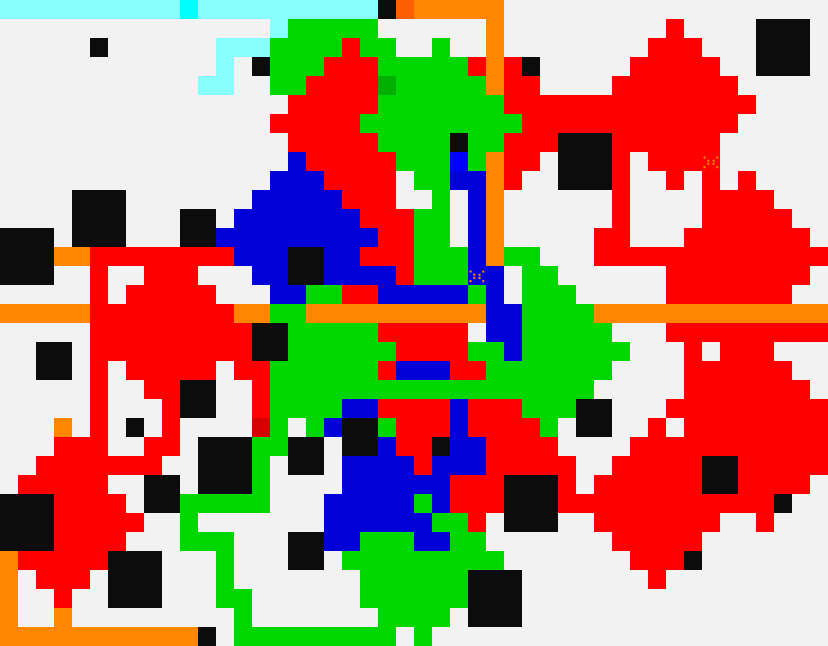
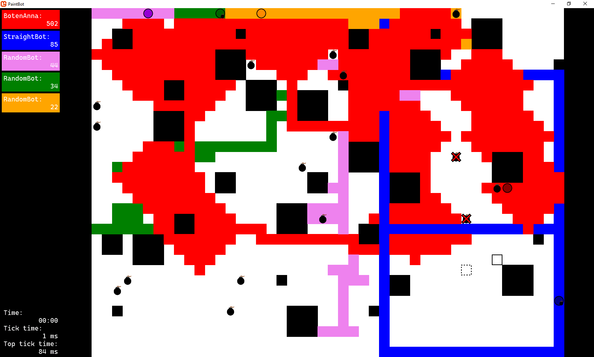
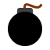

# Paintbot

This repo contains several versions of bots that can compete in
[Cygni's Paintbot Game](https://paintbot.cygni.se/). I've [tagged](https://github.com/89netraM/paintbot/tags)
some interesting versions of the bot in git.

## Interesting features

Some features that I think are interesting. Some of them, most other bots have,
but some of them are pretty unique.

### Pathfinding

Located in the [`Pathfinder.cs`](./Pathfinder.cs) file is a pretty standard
pathfinding algorithm. It's a breath-first-search algorithm with weighted steps.
In the current version, as of writing, this means that paths over other players
colours are effectively shorter than paths over white tiles, and definitely
shorter than over my own colour.

### Caching

Many of the calculations done by the bot are cached, either for the duration of
the game or the tick depending on the lifetime of the calculation. This includes
stuff like obstacle coordinates, the points for taking a specific coordinate,
and many more. Cached calculations are mostly done in the [`StatePaintbot.cs`](./StatePaintbot.cs)
file.

### Action Sequence

Another interesting thing the [`StatePaintbot.cs`](./StatePaintbot.cs) file does
is is to allow a "stateful execution sequence". Using C# [`yield return`](https://docs.microsoft.com/en-us/dotnet/csharp/language-reference/keywords/yield)
feature `StatePaintbot` allows use to write as in the example to perform two or
more actions after one another without loosing the context of the method.

In this example, the `path` is calculated in the first tick. Then each step in
the path is executed in the following ticks, with the first step being executed
in the first tick.
```csharp
protected override IEnumerable<Action> GetActionSequence()
{
	Action[] path = new[] { Action.Left, Action.Right };
	foreach (Action step in path)
	{
		yield return step;
	}
}
```

### ANSI Printer

This is something that the standard Java client from Cygni comes packaged with,
but unfortunately the standard C# client lacks. It prints the game in full
colour to the console while it plays live. This is a way to get more immediate
feedback on what the bot does. The local bot is always red, so that it's
recognisable, and the others are given random colours.

An ANSI game can looks something like the following:


The code behind this can be found in the [`AnsiPrinter.cs`](./AnsiPrinter.cs)
file.

### Game GUI

Perhaps the most interesting feature is the live game GUI located in the
[`PaintbotGame.cs`](./PaintbotGame.cs) file. Using [MonoGame](https://www.monogame.net/)
a window with the game arena, and various stats, are shown to the user.

Each tick is delayed to at least half of the available tick time so that the
user has time to react to what happens on screen. This is because users can take
control of the bot. By left clicking the user can force the bot to go to a
specific tile, via pathfinding. By middle clicking the user prevents the bot
from stepping on the specified tile, and clearing disabled tiles with the escape
key. And by pressing space the user can set off a power-up, if the bot is
carrying one.

The GUI currently looks as following:


| Icon                                               | Description          |
| -------------------------------------------------- | -------------------- |
|        | Bot                  |
|       | Power-Up             |
|  | User hovering        |
|  | User selected target |
|         | User "disabled" tile |
